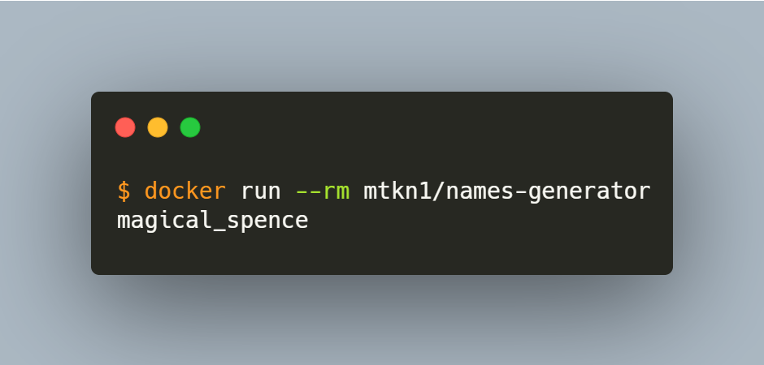

# names-generator

Generate a random name like Docker container.



## Overview

Unlike other clone libraries, `names-generator` builds and runs official Go modules. This means it works 100% identical to Docker's name generator!

## Usage

Run the following command in your terminal with Docker installed.

```bash
$ docker run --rm mtkn1/names-generator
intelligent_curie
```

Results are output to standard output.

`names-generator` is useful for naming temporary files and directories.

For example, this is how you can create a directory with a random name!

```bash
$ mkdir `docker run --rm mtkn1/names-generator`
$ ls -F
adoring_meninsky/
```

## Docker Hub

https://hub.docker.com/r/mtkn1/names-generator
